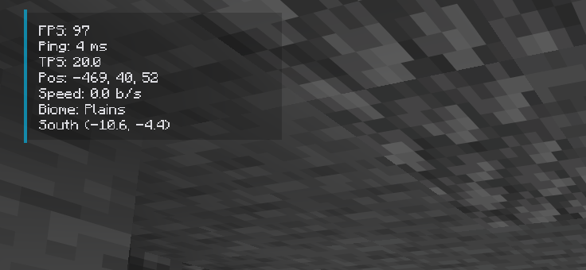
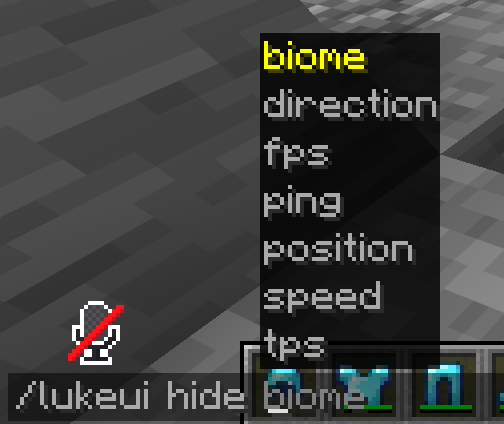
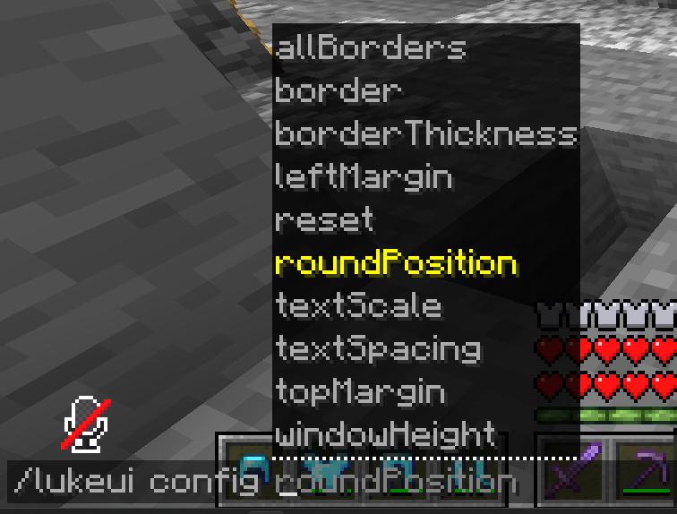

# Luke UI

A client side fabric mod that shows helpful information on the screen and it's also my first public minecraft mod. It can show your FPS, ping, TPS, position, speed, biome and direction.
In the future I'm planning to add stuff like nether position and colors to all the text. Also I'm planning on adding configs for opacity and color.

## Config

You can configure all settings with `/lukeui`

To hide and show elements, use `/lukeui hide` and `/lukeui show`.

You can change all settings using `/lukeui config`, for stuff like borders, width, margins and thickness.

